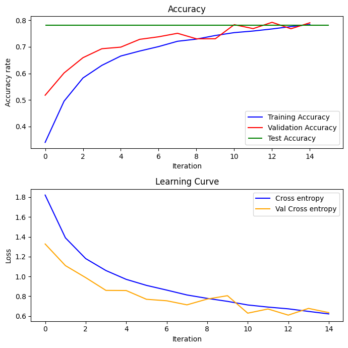
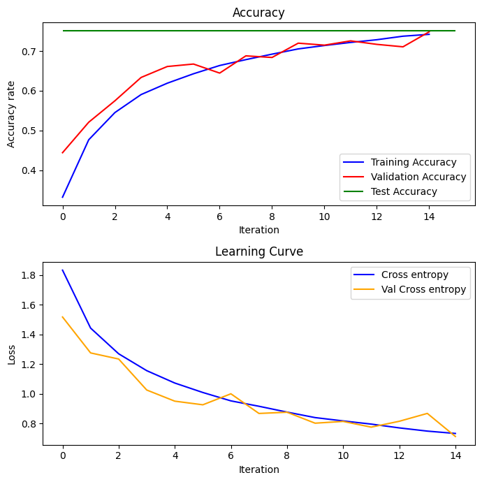
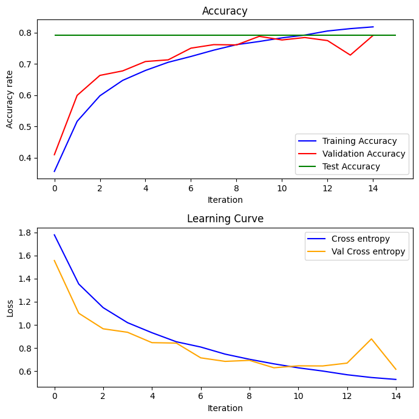
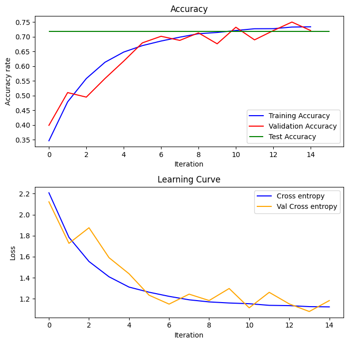

# cifar10-cnn-experiments
CNN experiments on CIFAR-10 comparing kernel size, stride, and L2 regularization, with learning curves, weight distributions, misclassification analysis, and feature-map visualization.

# CIFAR-10 Image Recognition with Convolutional Neural Networks

A CNN-based image classification project on **CIFAR-10** that studies the effect of **kernel size**, **stride**, and **L2 regularization** on performance, while also analyzing **learning curves**, **weight/bias distributions**, **misclassified examples**, and **intermediate feature maps**.

## Overview

This project trains and evaluates a compact Convolutional Neural Network on the **CIFAR-10** dataset.  
The main goal is not only to achieve strong classification performance, but also to understand how architectural and regularization choices affect learning and generalization.

The project investigates:

- image preprocessing and augmentation
- the effect of convolution kernel size
- the effect of stride on spatial detail retention
- the impact of L2 regularization on overfitting
- learning curves and model behavior
- weight and bias distributions
- correctly classified vs misclassified samples
- feature-map visualization across convolutional layers

---

## Dataset

The project uses the **CIFAR-10** dataset, which contains:

- **60,000 RGB images**
- image size: **32 × 32 × 3**
- **10 classes**:
  - airplane
  - automobile
  - bird
  - cat
  - deer
  - dog
  - frog
  - horse
  - ship
  - truck

Split used in this project:

- **45,000 training images**
- **5,000 validation images**
- **10,000 test images**

---

## Preprocessing and Augmentation

### Normalization
All pixel values are scaled to the range `[0, 1]` by dividing by `255`.

### Validation Split
From the original 50,000 training images, 5,000 were reserved for validation and the remaining 45,000 were used for training.

### Data Augmentation
To improve generalization and reduce overfitting, augmentation was applied only to training images using:

- random horizontal flips
- random rotations up to ±15°
- width and height shifts up to 10%
- random zoom up to 10%

---

## Model Architecture

A compact CNN architecture was used for CIFAR-10 classification.

### Network Design
The model contains:

- **Two convolutional blocks**
  - each block has:
    - `Conv2D`
    - `Conv2D`
    - `BatchNormalization`
    - `MaxPooling2D`
    - `Dropout`

- **Dense classifier**
  - `Flatten`
  - `Dense(128, ReLU)`
  - `Dropout`
  - final `Softmax` output layer

### Default Settings

- kernel size: **(3, 3)**
- stride: **(1, 1)**
- dropout: **0.4**
- initialization: **He normal**
- optimizer: **Adam**

### Regularized Model
An L2-regularized variant was also tested, where L2 regularization was applied to all convolutional and dense layers.

---

## Experimental Setup

The following settings were used unless otherwise stated:

- **Optimizer:** Adam
- **Learning rate:** `1e-3`
- **Loss:** Sparse categorical cross-entropy
- **Epochs:** 15
- **Batch size:** 128
- **Metrics:** Accuracy and cross-entropy loss

The following model configurations were compared:

1. **Baseline:** kernel `(3,3)`, stride `(1,1)`
2. **Large Stride:** kernel `(5,5)`, stride `(2,2)`
3. **Large Kernel:** kernel `(7,7)`, stride `(1,1)`
4. **L2 Regularized:** kernel `(7,7)`, stride `(1,1)` with L2 regularization

---

## Results

### Quantitative Comparison

| Model | Kernel | Stride | Train Acc | Val Acc | Train Loss | Val Loss |
|---|---|---|---:|---:|---:|---:|
| Baseline | (3,3) | (1,1) | 0.7846 | 0.7908 | 0.6223 | 0.6352 |
| Large Stride | (5,5) | (2,2) | 0.7422 | 0.7486 | 0.7331 | 0.7128 |
| Large Kernel | (7,7) | (1,1) | 0.8189 | 0.7916 | 0.5285 | 0.6162 |
| L2 Regularized | (7,7) | (1,1) | 0.7339 | 0.7212 | 1.1238 | 1.1836 |

### Key Observations

- **(3×3, stride 1)** provides the best balance of accuracy and efficiency for CIFAR-10-sized images.
- **Larger stride (2×2)** reduces performance because it downsamples too aggressively and loses useful spatial detail.
- **Larger kernels (7×7)** improve training accuracy, but only marginally improve validation accuracy.
- **L2 regularization** reduces overfitting and smooths learned representations, but can also lead to underfitting if the regularization strength is too high.

---

## Learning Curves

The learning curves show the evolution of training and validation accuracy/loss across epochs.

Suggested images to include in your repo:

---
## Weight and Bias Distribution Analysis

The project also analyzes the learned parameter distributions across layers.

This includes:

1. histogram of convolutional weights
2. histogram of dense-layer weights
3. histogram of biases
4. effect of L2 regularization on parameter magnitude

 
Main Insight

L2 regularization leads to:

1. smaller weight magnitudes
2. smoother parameter distributions
3. more stable feature activations
4. reduced overfitting

Baseline Model :

Large Kernel Weight Distribution : 

L2 Weight Distribution : 

---

